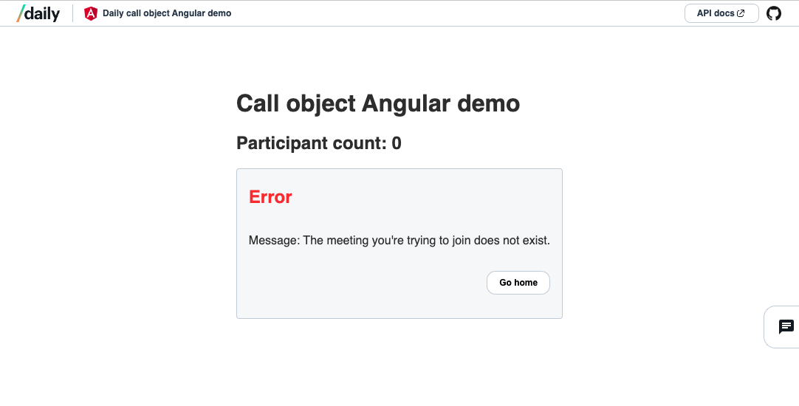

# Daily custom Angular video call app with chat


This sample app demonstrates how to build a Daily video app with [Angular](https://angular.io/) and [`daily-js`](https://github.com/daily-co/daily-js).

## Features

This sample app includes:

- Multi-participant video call functionality
- Media device controls to toggle local video and audio.
- Local chat between participants in the call. (This does not include chat history but that's also possible.)
- Error message if the Daily room does not exist.
- "Page not found" message for routes not covered by this demo.




It does not include:

- Device selection
- Meeting room access controls (i.e., knocking to enter private rooms)
- Prejoin UI (i.e., a video preview before joining the call)

These can be added, though! :)

## Requirements

To use this sample app, you will need to:

1. Create a Daily account (for free!) at [https://dashboard.daily.co/signup](https://dashboard.daily.co/signup).
2. Create a public Daily room at [https://dashboard.daily.co/rooms/create](https://dashboard.daily.co/rooms/create). You can also use the [REST API](https://docs.daily.co/reference/rest-api/rooms/create-room#example-requests) to do this.

## Run app locally

To run this sample app locally, run the following commands in your terminal:

```bash
# clone the repo
git clone https://github.com/daily-demos/daily-angular.git
# change directories to local copy
cd daily-angular
# install dependencies
npm install
# start dev server
ng serve
```

Navigate to `http://localhost:4200/`. The application will automatically reload if you change any of the source files.

---

## Additional information from Angular

This project was generated with [Angular CLI](https://github.com/angular/angular-cli) version 16.0.5.

### Development server

Run `ng serve` for a dev server.

### Code scaffolding

Run `ng generate component component-name` to generate a new component. You can also use `ng generate directive|pipe|service|class|guard|interface|enum|module`.

### Build

Run `ng build` to build the project. The build artifacts will be stored in the `dist/` directory.

### Further help

To get more help on the Angular CLI use `ng help` or go check out the [Angular CLI Overview and Command Reference](https://angular.io/cli) page.
